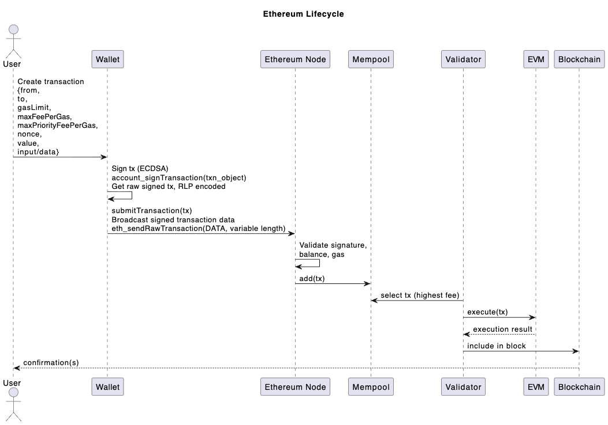
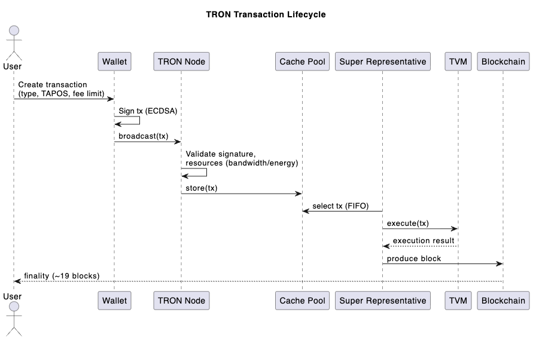

# TRON-ETH raw txn Adapters & Interfaces

## TLDR

Experimental project, we aim to understand and demonstrate the fundamental differences between Ethereum and TRON in regards of their transaction life cycle to eventually improve TRON EVM compatibility trough json-rpc interfaces

## Goal

Create a basic Ethereum --> TRON raw transaction adapter POC to ultimately serve as interface mock up to enable the following json-rpc methods on TRON:

* eth_sendRawTransaction
* eth_signTransaction
* eth_getTransactionCount

## Motivation

TRON has known limitations on its json-rpc interface and state management, causing critical Ethereum tooling incompatibility, which prevents both, EVM developers and TRON developers to utilize Ethereum tooling, such as:

* Foundry/Alloy
* viem
* Hardhat
* etc

## State of the Art Research

Ethereum JSON-RPC methods fall into three main categories:

1. Gossip: These methods track the latest block of the chain, no history or state is needed
   * eth_blockNumber --> Fully supported on TRON
   * eth_sendRawTransaction --> Not supported on TRON (Neded in Foundry)
2. State: These methods get the chain "state" as per specif block hight, TRON doesn't track state as of now, so only "latest" data is available, efforts are being made based on Erigon to allow this. Archive node WiP [here](https://github.com/tronprotocol/java-tron/issues/6289):
   * eth_getTransactionCount --> Not supported on TRON (Needed in Foundry)
   * eth_call --> Partially implemented, only "latest" QUANTIT/TAG is available
3. History: Fetches historical records from the blockchains , generally no show-stopper compatibility issues here for TRON
   * eth_getBlockByHash --> Fully supported on TRON
   * eth_getTransactionReceipt -->Suppported, minimal differences

As of Jan 9 2026,  based on online research, public forums, github repos and AI, no relevant progress has been made to implement eth_sendRawTransaction, eth_getTransactionCount and eth_signTransaction on TRON, which, based on the Ethereum transaction life cycle as well as Foundry basic contract deployment dependencies are needed across several EVM tooling.

## Initial Scope

1. Create the necesary interfaces or adapters so we can compile & deploy SC using Foundry without relying on Alloy-rs team to develop specific TRON solutions.

## Potential work arounds

We don't need to create an RLP <> protobuf converter, that would be too complicated and unnecesary. We'll attempt to handle this trough interfaces (eth_sendRawTransaction) and popular client primitives to handle TRON tx signing.

An Ethereum tx lifercycle looks like this:

whereas a TRON tx lifecycle looks like this:

1. Create interfaces in java-tron for the missing methods:
   * eth_sendRawTransaction -->[ wallet/broadcasthex](https://developers.tron.network/reference/broadcasthex)
   * eth_signTransaction --> Generate this with TRON SDK(tronweb,pytron, @viem/tron, etc clients), how can we address this if viem or foundry tools do not recognize tron sdks ? Is it doable?

     * ethers, web3.js: Not recommended as we already have similar client solutions for TRON
     * Does foundry require signing at some point? which method does it use?
     * viem: We can build a @viem/tron package so developers can use viem, which is a modern alternative for ethers and web3 anyways, responsabilities for both viem and @viem/tron will be as follows:

     | Task                     | Tool       |
     | ------------------------ | ---------- |
     | ABI parsing              | viem       |
     | ABI encoding             | viem       |
     | ABI decoding             | viem       |
     | Wallet connection (TRON) | @viem/tron |
     | Transaction building     | @viem/tron |
     | Signing                  | @viem/tron |
     | Broadcasting             | @viem/tron |
   * eth_getTransactionCount --> More research is needed, probably will have to wait for Archive node to be implemented? No efficient way for a tron full node to query this, tronscan API equivalente: https://docs.tronscan.org/api-endpoints/transactions-and-transfers#get-accounts-transaction-datas
